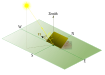

# pysolorie

**pysolorie** stands for **Py**thon **Sol**ar **Orie**ntation Analysis of Solar Panel. It is a Python library designed to help you analyze the orientation of solar panels.

How can one maximize the solar irradiation energy received by a solar panel?

## Features

``pysolorie`` is a library designed to help you find this optimal orientation. Its features include, but are not limited to:

- Finding the optimal orientation for a fixed solar panel, assuming a clear-sky model.
- Plotting the optimal orientation over a range of days.
- Plotting the total direct irradiation over a range of days.
- Generating a CSV report detailing the optimal orientation over a range of days.
- Calculating the sunrise and sunset hour angles for a specific day.
- Utilizing Hottel’s Model to estimate the transmittance of clear-sky beam radiation.
- Calculating the solar zenith angle.
- Calculating the solar time.
- Calculating solar declination and hour angle.

## Documentation

You can find the complete documentation for pysolorie at our [Read the Docs page](https://pysolorie.readthedocs.io/).

## Contributing

We welcome contributions to pysolorie! If you're interested in contributing, please take a look at our [contribution guidelines](https://pysolorie.readthedocs.io/en/latest/contributing.html) for detailed information on how you can help.

Thank you for considering contributing to pysolorie!
