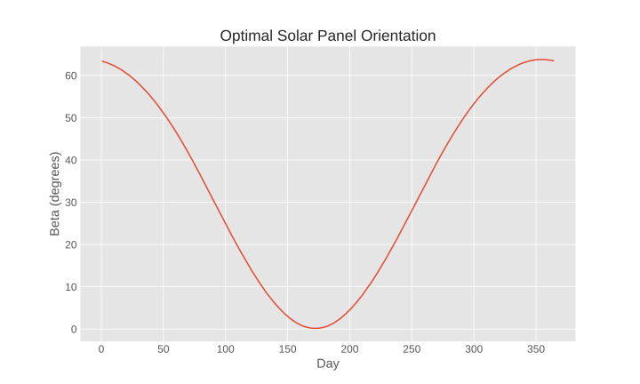

Getting Started
===============
This guide will help you get started with using the pysolorie library.

How to Install pysolorie
------------------------

``pysolorie`` requires Python 3.9 or higher.

The easiest way to install ``pysolorie``  is from PyPI.

.. code-block:: bash

    python3 -m pip install pysolorie

Calculating Direct Irradiation for a Year
-----------------------------------------

Suppose we aim to calculate the direct irradiation for a specific location. The following code determines the direct irradiation received by a solar panel, assuming an optimal tilt angle for each day of the year at a given location. In this scenario, the location is Tehran, Iran.

.. code-block:: python

   from pysolorie import IrradiationCalculator

   # Instantiate an IrradiationCalculator object for the city of Tehran
   calculator = IrradiationCalculator(
       climate_type="MIDLATITUDE SUMMER",
       observer_altitude=1200,
       observer_latitude=35.6892
   )

   from_day = 1
   to_day = 365
   total_irradiation = 0

   # Loop over each day of the year
   for day in range(from_day, to_day + 1):
       # Find the optimal tilt angle for the given day
       optimal_tilt_angle = calculator.find_optimal_orientation(day)
       # Calculate the direct irradiation for the given day and add it to the total
       total_irradiation += calculator.calculate_direct_irradiation(
           optimal_tilt_angle, day
       )

   # Print the total direct irradiation received by the solar panel over the year
   print(total_irradiation)

Finding the Optimal Orientation
-------------------------------

The ``find_optimal_orientation`` method finds the optimal tilt angle for a solar
panel given the climate type, observer altitude, observer latitude, and day of the year.

The ``climate_type`` can be one of the following:

- ``"MIDLATITUDE SUMMER"``
- ``"MIDLATITUDE WINTER"``
- ``"TROPICAL"``
- ``"SUBARCTIC SUMMER"``

.. code-block:: python

    from pysolorie import IrradiationCalculator

    # Instantiate an IrradiationCalculator object for the city of Tehran
    calculator = IrradiationCalculator(
        climate_type="MIDLATITUDE SUMMER",
        observer_altitude=1200,
        observer_latitude=35.6892
    )

    # Find the optimal orientation for June 21st
    result = irradiation_calculator.find_optimal_orientation(172)

    print(f"Optimal orientation: {result}")

Calculating Direct Irradiation
------------------------------
The ``calculate_direct_irradiation`` method calculates the direct irradiation received by a solar panel for a specified tilt angle and day of the year.

The ``climate_type`` can be one of the following:

- ``"MIDLATITUDE SUMMER"``
- ``"MIDLATITUDE WINTER"``
- ``"TROPICAL"``
- ``"SUBARCTIC SUMMER"``

.. code-block:: python

    from pysolorie import IrradiationCalculator

    # Instantiate an IrradiationCalculator object for the city of Tehran
    calculator = IrradiationCalculator(
        climate_type="MIDLATITUDE SUMMER",
        observer_altitude=1200,
        observer_latitude=35.6892
    )

    # Define the panel orientation and day of the year
    panel_orientation: float = 45.0  # degrees
    day_of_year: int = 172  # June 21, approximately the summer solstice

    # Calculate the direct irradiation
    result = irradiation_calculator.calculate_direct_irradiation(panel_orientation, day_of_year)

    print(f"Direct irradiation: {result}")

Plotting the Optimal Orientation
--------------------------------

With the pysolorie package, you can plot the optimal orientation of a solar panel given the climate type, altitude, and latitude of the location. For instance, the following code plots the optimal orientation for each day of the year for the city of Tehran.

.. code-block:: python

   from pathlib import Path
   from pysolorie import IrradiationCalculator, Plotter

   # Instantiate a Plotter object from the pysolorie library
   plotter = Plotter()

   # Instantiate an IrradiationCalculator object for the city of Tehran
   irradiation_calculator = IrradiationCalculator(
       climate_type="MIDLATITUDE SUMMER",
       observer_altitude=1200,
       observer_latitude=35.6892
   )

   # Use the plotter to plot the optimal tilt angle of a solar panel for each day of the year
   plotter.plot_optimal_orientation(
       irradiation_calculator,
       from_day=1,
       to_day=365,
       path=Path("results.svg"),
       plot_kwargs={
           "xlabel": "Day",
           "ylabel": "Beta (degrees)",
           "title": "Optimal Solar Panel Orientation",
       },
       savefig_kwargs={"dpi": 300},
   )

This figure, generated by the example code, illustrates the optimal tilt angle of a solar panel for each day of the year in Tehran. The x-axis represents the day of the year, while the y-axis represents the optimal angle (Beta) in degrees. As can be seen, the optimal angle varies throughout the year, highlighting the importance of adjusting the tilt angle of the solar panel to maximize the energy received.

The ``plot_optimal_orientation`` method plots the optimal orientation for a range of days.

The plot will be saved to the specified path. The ``plot_kwargs`` and ``savefig_kwargs``
parameters can be used to customize the plot and the savefig function, respectively. If no path is provided, the plot will be displayed but not saved.
If the path is provided, the plot will be saved to the specified path and not displayed. If you want to both display and save the plot, you should call ``plt.show()`` after this function.

Plotting the Direct Irradiation
-------------------------------------

The ``plot_total_direct_irradiation`` method plots the direct irradiation for a range of days.

.. code-block:: python

    from pysolorie import Plotter, IrradiationCalculator
    from pathlib import Path

    # Create a plotter
    plotter = Plotter()
    # Instantiate an IrradiationCalculator object for the city of Tehran
    irradiation_calculator = IrradiationCalculator(
        climate_type="MIDLATITUDE SUMMER",
        observer_altitude=1200,
        observer_latitude=35.6892
    )

    # Plot the direct irradiation for days 60 to 70
    plotter.plot_total_direct_irradiation(
       irradiation_calculator,
       from_day=60,
       to_day=70,
       path=Path("results.png"),
       plot_kwargs={
           "xlabel": "Day",
           "ylabel": "Direct Irradiation (Megajoules per square meter)",
           "title": "Direct Irradiation",
       },
       savefig_kwargs={"dpi": 300},
    )

The plot will be saved to the specified path. The ``plot_kwargs`` and ``savefig_kwargs``
parameters can be used to customize the plot and the savefig function, respectively. If no path is provided, the plot will be displayed but not saved.
If the path is provided, the plot will be saved to the specified path and not displayed. If you want to both display and save the plot, you should call ``plt.show()`` after this function.

Generating Reports
------------------

The ``pysolorie`` package provides methods to generate reports of the optimal orientation for a range of days in different formats: CSV, JSON, and XML.

.. code-block:: python

   from pysolorie import ReportGenerator, IrradiationCalculator
   from pathlib import Path

   # Create a report generator and an irradiation calculator
   report_generator = ReportGenerator()
   irradiation_calculator = IrradiationCalculator(
       climate_type="MIDLATITUDE SUMMER",
       observer_altitude=1200,
       observer_latitude=35.6892,
   )

   # Generate a CSV report for days 60 to 70
   report_generator.generate_optimal_orientation_csv_report(
       path=Path('results.csv'),
       irradiation_calculator=irradiation_calculator,
       from_day=60,
       to_day=70,
   )

   # Generate a JSON report for days 60 to 70
   report_generator.generate_optimal_orientation_json_report(
       path=Path('results.json'),
       irradiation_calculator=irradiation_calculator,
       from_day=60,
       to_day=70,
   )

   # Generate an XML report for days 60 to 70
   report_generator.generate_optimal_orientation_xml_report(
       path=Path('results.xml'),
       irradiation_calculator=irradiation_calculator,
       from_day=60,
       to_day=70,
   )

The report files will be saved to the specified paths.

Calculating Sunrise and Sunset
------------------------------

The ``calculate_sunrise_sunset`` method calculates the sunrise and sunset hour angles for a given day of the year.

.. code-block:: python

   from pysolorie import Observer

   # Create an observer located in Tehran
   observer = Observer(observer_latitude=35.69)

   # Calculate the sunrise and sunset hour angles for June 21st
   sunrise_hour_angle, sunset_hour_angle = observer.calculate_sunrise_sunset(
       day_of_year=172
   )

   print(f"Sunrise hour angle: {sunrise_hour_angle}")
   print(f"Sunset hour angle: {sunset_hour_angle}")

Calculating the Solar Zenith Angle
----------------------------------

The ``calculate_zenith_angle`` method calculates the zenith angle given the day of the year
and solar time.

.. code-block:: python

   from pysolorie import Observer

   # Create an observer located in Tehran (latitude 35.69, longitude 51.39)
   observer = Observer(35.69, 51.39)

   # Calculate the zenith angle for March 22nd (81st day of the year)
   # at solar noon (12 * 60 * 60 seconds)
   zenith_angle = observer.calculate_zenith_angle(81, 12 * 60 * 60)

   print(f"Zenith angle: {zenith_angle}")

Note that the observer's latitude must be provided when creating an ``Observer`` instance.
If it's not provided, a ``ValueError`` will be raised:

.. code-block:: python

    from pysolorie import Observer

    # Attempt to create an observer without specifying the latitude
    try:
        observer = Observer(None, 0)
        observer.calculate_zenith_angle(1, 12 * 60 * 60)
    except ValueError as e:
        print(f"Caught an exception: {e}")

Calculating Solar Time
----------------------

The ``solar_time`` method calculates the solar time given the hour angle.

.. code-block:: python

    from pysolorie import SunPosition

    # Create a SunPosition instance
    sun_position = SunPosition()

    # Calculate the solar time for solar noon (hour angle 0)
    solar_time = sun_position.solar_time(0)

    print(f"Solar time: {solar_time}")

This will print the solar time in seconds. For example,
solar noon (when the sun is at its highest point in the sky)
corresponds to ``12 * 60 * 60 = 43200`` seconds.

Calculating Solar Declination and Hour Angle
--------------------------------------------

The ``solar_declination`` method calculates the solar declination given the day of the year,
and the ``hour_angle`` method calculates the hour angle given the solar time.

.. code-block:: python

    from pysolorie import SunPosition

    # Create a SunPosition instance
    sun_position = SunPosition()

    # Calculate the solar declination for January 1st
    declination = sun_position.solar_declination(1)

    # Calculate the hour angle for 1pm (13 * 60 * 60 seconds)
    hour_angle = sun_position.hour_angle(13 * 60 * 60)

    print(f"Solar declination: {declination}")
    print(f"Hour angle: {hour_angle}")

This will print the solar declination and hour angle in radians.
For example, on January 1st at 1pm, the solar declination is approximately ``-0.401`` radians and the hour angle is approximately ``0.262`` radians.

Calculating Transmittance Components with the Hottel's Model
------------------------------------------------------------

The Hottel's model  is used for estimating clear-sky beam radiation transmittance based on climate type and observer altitude. The `calculate_transmittance_components` method of the `HottelModel` class calculates the components of clear-sky beam radiation transmittance :math:`a_0`, :math:`a_1`, and :math:`k` based on climate type and observer altitude.

.. code-block:: python

    from pysolorie import HottelModel

    # Create a HottelModel instance
    hottel_model = HottelModel()

    # Calculate the transmittance components for Tehran in the summer at an altitude of 1200m
    result = hottel_model.calculate_transmittance_components("MIDLATITUDE SUMMER", 1200)

    print(f"Transmittance components: {result}")

This will print the transmittance components as a tuple of three values. For example, for Tehran in the summer at an altitude of 1200m, the transmittance components are approximately ``(0.228, 0.666, 0.309)``.

The ``climate_type`` parameter can be one of the following:

- ``"TROPICAL"``
- ``"MIDLATITUDE SUMMER"``
- ``"SUBARCTIC SUMMER"``
- ``"MIDLATITUDE WINTER"``

If an invalid climate type is provided, a ``ValueError`` will be raised.
