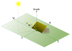

.. pysolorie documentation master file, created by
   sphinx-quickstart on Sun Dec 10 14:02:09 2023.
   You can adapt this file completely to your liking, but it should at least
   contain the root `toctree` directive.

pysolorie: Orientation Analysis of Solar Panel
==============================================

Introduction
============

How can one maximize the solar irradiation energy received by a solar panel? [1]_

The amount of solar irradiation energy harvested by a solar collector depends on several factors: the time of irradiation
(both the time of day and the day of the year), the latitude and climate of the location, and the shape and orientation of the solar panel [2]_.
A solar collector can be positioned at a fixed orientation to maximize energy reception for a specific time period, such as daily, weekly, monthly, or seasonally,
or it can be fixed for optimal performance throughout the year.
The orientation can then be adjusted for the next time period. Solar irradiation is composed of three components: the direct beam, sky diffusion, and ground reflection.
Now, we are considering flat solar panels and focusing on direct beam irradiation, which contributes the most to solar irradiation.
There are various models available for different climate types.
Moreover, a cloudy sky or polluted air affects the solar energy received on Earth.
In our case, we are using Hottel's model to estimate the transmittance of direct solar radiation through clear atmospheres [3]_.

``pysolorie`` is a library designed to help you find this optimal orientation. Its features include, but are not limited to:

- Finding the optimal tilt angle for a fixed solar panel, assuming a clear-sky condition.
- Plotting the optimal tilt angle over a range of days.
- Plotting the daily direct irradiation energy over a range of days.
- Generating a CSV, JSON, or XML report detailing the optimal tilt angle over a range of days.
- Calculating the sunrise and sunset hour angles for a specific day.
- Utilizing Hottel's model to quantify clear-sky conditions and estimate the atmospheric transmission of clear-sky beam radiation.
- Calculating the solar zenith angle.
- Calculating the solar time.
- Calculating solar declination and hour angle.

References
^^^^^^^^^^

.. [1] Aghamohammadi, A., & Foulaadvand, M. (2023). Efficiency comparison between tracking and optimally fixed flat solar collectors. Scientific Reports, 13(1).
.. [2] Foulaadvand, M., & Aghamohammadi, A. (2023). Evaluation of direct beam energy received by convex solar collectors and their optimal orientations. Journal of Renewable and Sustainable Energy, 15(5).
.. [3] Hottel, H. (1976). A simple model for estimating the transmittance of direct solar radiation through clear atmospheres. Solar Energy, 18(2), 129–134.

Contents
=====================================

.. toctree::
   :maxdepth: 2

   getting_started
   reference/modules
   contributing
   license
   changelog
   GitHub <https://github.com/aaghamohammadi/pysolorie>

Indices and tables
==================

* :ref:`genindex`
* :ref:`modindex`
* :ref:`search`
