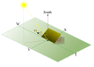

# Summary
How can one maximize the solar irradiation energy received by a solar panel [@Aghamohammadi2023]?

**pysolorie** stands for **Py**thon **Sol**ar **Orie**ntation Analysis of Solar Panel. It is a Python package designed to help you find the optimal orientation of solar panels, $\beta$, to maximize the energy received for a given day. Its features include but are not limited to:

- Finding the optimal orientation for a fixed solar panel, assuming a clear-sky model.
- Plotting the optimal orientation over a range of days.
- Plotting the total direct irradiation over a range of days.
- Generating a CSV, JSON, or XML report detailing the optimal orientation over a range of days.
- Utilizing Hottel’s Model to estimate the transmittance of clear-sky beam radiation [@Hottel1976].

# Statement of need
The amount of solar irradiation energy harvested by a solar collector depends on several factors. These include the time of irradiation (both the time of day and the day of the year), the latitude and climate of the location, and the shape and orientation of the solar panel [@Foulaadvand2023].
A solar collector can be positioned at a fixed orientation to maximize energy reception for a specific time period, such as daily, weekly, monthly, or seasonally, or it can be fixed for optimal performance throughout the year. The orientation can then be adjusted for the next time period.
Solar irradiation is composed of three components: the direct beam, sky diffusion, and ground reflection. For flat solar panels, we focus on direct beam irradiation, which contributes the most to solar irradiation. There are various models available for different climate types. We assume a clear sky condition with no clouds in the sky and an atmosphere free of pollutants. However, a cloudy sky or polluted air may affect the amount of solar energy received on Earth. In this context, we focus on the overall received irradiation energy. There are some other issues which may require careful consideration and further investigation in future studies, such as panel efficiency, energy conversion, and the effects of air pollution.
 In our case, we use Hottel’s model to estimate the transmittance of direct solar radiation through clear atmospheres [@Hottel1976].

 With a well-defined, user-friendly, and extensible API, multiple audiences can benefit from `pysolorie`. These include solar energy researchers, solar panel manufacturers and installers, and instructors.

`Astropy` is the most well-known Python package with comprehensive functionality for astronomy and astrophysics [@Astropy2022]. It provides astronomical coordinate systems, cosmological calculations, and many more features. However, it lacks the ability to determine the optimal orientation of a solar panel, a feature that `pysolarorie` provides.

# Mathematics
The energy collected by a solar panel can be calculated using the formula in Equation \ref{eq:totaldirect}, where:

- $n$ is the day of the year,
- $\phi$ is the latitude of the observer,
- $I$ is the amount of solar energy received per unit area per second [@DuffieDeceased2020],
- $\Omega$ is a constant equal to `7.15 * 1e-5`,
- $\theta$ is the angle between the position vector of the sun and the normal vector to the solar panel,
- $\omega_s$ is the sunrise hour angle,
- $\omega_t$ is the sunset hour angle,
- $H$ is the Heaviside step function,
- $\tau_b$ is the transmittance of the beam [@Hottel1976].

\begin{equation}\label{eq:totaldirect}
E(n,\phi) = \frac{I}{\Omega} \int_{\omega_s}^{\omega_t}\cos(\theta) \times H(\cos(\theta)) \times \tau_b~d\omega
\end{equation}

# References
